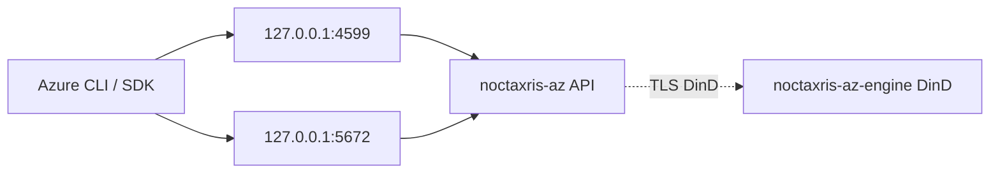

<p align="center">
  
</p>

<p align="center">
  <b>Run Azure-shaped security labs on your laptop without a cloud bill or a host Docker socket.</b>
</p>

```bash
docker pull kyaxris/noctaxris-az:latest
# Container bind is 0.0.0.0; generate unique roots (shipped example pair is refused).
ROOT_ID="$(openssl rand -hex 16)"
ROOT_TOKEN="$(openssl rand -hex 32)"
docker run -d --name noctaxris-az -p 127.0.0.1:4599:4599 -p 127.0.0.1:5672:5672 \
  -e NOCTAXRIS_AZ_LISTEN=0.0.0.0:4599 \
  -e NOCTAXRIS_AZ_AMQP_LISTEN=0.0.0.0:5672 \
  -e NOCTAXRIS_AZ_ALLOW_NONLOOPBACK_LISTEN=1 \
  -e NOCTAXRIS_AZ_ROOT_CLIENT_ID="$ROOT_ID" \
  -e NOCTAXRIS_AZ_ROOT_ACCESS_TOKEN="$ROOT_TOKEN" \
  kyaxris/noctaxris-az:latest
curl http://127.0.0.1:4599/_noctaxris-az/health
# ok
```

<p align="center">
  <a href="https://github.com/Kyaxris-Labs/Noctaxris-AZ/actions/workflows/ci.yml"></a>
  <a href="https://hub.docker.com/r/kyaxris/noctaxris-az"></a>
  <a href="https://hub.docker.com/r/kyaxris/noctaxris-az/tags"></a>
  <a href="LICENSE"></a>
</p>

Point Azure clients at `http://127.0.0.1:4599` with `Authorization: Bearer <token>` (Storage Shared Key / SAS; Service Bus AMQP on `:5672`).

Go module: [`github.com/Kyaxris-Labs/Noctaxris-AZ`](https://github.com/Kyaxris-Labs/Noctaxris-AZ). Image tags: `latest`, semver releases, and `nightly` from CI.

## Why this exists

| | |
|---|---|
| Lab fidelity | Entra (ROPC + apps lite), Managed Identity (user + system), ARM/RBAC, Key Vault (+ certs), Storage, Cosmos, Service Bus/Event Hubs/Event Grid, nested SQL/Postgres/Redis/ACR theatre, Network/VM/AKS, App/edge/AI labs, Monitor/Log Analytics |
| Secure defaults | Loopback publish only. No host `docker.sock`. Master key outside the data root |
| Dual listeners | HTTP `:4599` plus AMQP lite `:5672` for Service Bus clients |
| Nested compute | DinD via Compose engine over TLS is opt-in when present. Default Functions invoke stays mock |

## Quick start

Pull the Hub image, run it on loopback `:4599`, then hit the subscription with the same root Bearer you passed in.

```bash
docker pull kyaxris/noctaxris-az:latest

ROOT_ID="$(openssl rand -hex 16)"
ROOT_TOKEN="$(openssl rand -hex 32)"

docker run -d --name noctaxris-az -p 127.0.0.1:4599:4599 -p 127.0.0.1:5672:5672 \
  -e NOCTAXRIS_AZ_LISTEN=0.0.0.0:4599 \
  -e NOCTAXRIS_AZ_AMQP_LISTEN=0.0.0.0:5672 \
  -e NOCTAXRIS_AZ_ALLOW_NONLOOPBACK_LISTEN=1 \
  -e NOCTAXRIS_AZ_ROOT_CLIENT_ID="$ROOT_ID" \
  -e NOCTAXRIS_AZ_ROOT_ACCESS_TOKEN="$ROOT_TOKEN" \
  kyaxris/noctaxris-az:latest

curl http://127.0.0.1:4599/_noctaxris-az/health
curl http://127.0.0.1:4599/_noctaxris-az/ready

SUB=00000000-0000-0000-0000-000000000002
curl -H "Authorization: Bearer $ROOT_TOKEN" \
  "http://127.0.0.1:4599/subscriptions/$SUB?api-version=2022-12-01"
```

When Compose files are present, copy `docker/.env.example` to `docker/.env`, replace both root values with unique lab credentials, then `docker compose -f docker/compose.yaml --env-file docker/.env up --build`. Default host publish is `127.0.0.1:4599` (AMQP optional). Per-service smoke: [docs/services/](docs/services/index.md).

## Services

| Area | Services |
|------|----------|
| Identity | Microsoft Entra ID, Managed Identity, Subscriptions / resource groups, Authorization (RBAC) |
| Crypto | Key Vault |
| Data | Storage (blob, queue, table), Cosmos DB, Azure SQL, PostgreSQL, Redis, ACR |
| Messaging | Service Bus, Event Hubs, Event Grid |
| Network | Virtual Network, NSG, NIC, DNS, Load Balancer, Application Gateway |
| Compute | Virtual Machines, AKS, Azure Functions |
| App | App Configuration, App Service (staticSites lite), Container Apps, Logic Apps, API Management |
| Observe | Monitor / Activity Log, Log Analytics |
| Edge / AI | Front Door / CDN profiles, ACS Email, Cognitive / Azure OpenAI, SignalR |

Open the service matrix for detailed actions and gaps. Full notes and CLI smoke: [docs/services/](docs/services/index.md).

<details>
<summary><b>Service matrix</b> (detailed actions / not implemented)</summary>

<table>
  <thead>
    <tr>
      <th>Area</th>
      <th>Services</th>
      <th>Detailed actions</th>
      <th>Not implemented</th>
    </tr>
  </thead>
  <tbody>
    <tr>
      <td rowspan="4" align="center" valign="middle">Identity</td>
      <td>Microsoft Entra ID</td>
      <td>OIDC/JWKS; client credentials + ROPC lite; app registration CRUD lite.</td>
      <td>Microsoft-signed JWTs; Graph; auth code / device code.</td>
    </tr>
    <tr>
      <td>Managed Identity</td>
      <td>User-assigned + system-assigned ARM; IMDS token theatre.</td>
      <td>Real <code>169.254.169.254</code>; workload identity federation.</td>
    </tr>
    <tr>
      <td>Subscriptions / RGs</td>
      <td>Seeded subscription get; RG CRUD; resources/providers lite.</td>
      <td>Subscription create/delete; management groups.</td>
    </tr>
    <tr>
      <td>Authorization</td>
      <td>Role assignments CRUD + list-by-scope; Owner/Contributor/Reader; root bypass.</td>
      <td>Custom roles; deny assignments; PIM.</td>
    </tr>
    <tr>
      <td align="center" valign="middle">Crypto</td>
      <td>Key Vault</td>
      <td>Vault ARM; secrets/keys; certificates lite; soft-delete theatre.</td>
      <td>Managed HSM; retention timers.</td>
    </tr>
    <tr>
      <td rowspan="6" align="center" valign="middle">Data</td>
      <td>Storage</td>
      <td>Blob/queue/table Shared Key + SAS.</td>
      <td>Files/HNS depth; Azurite multi-port default.</td>
    </tr>
    <tr>
      <td>Cosmos DB</td>
      <td>Account ARM; in-process NoSQL point read/query lite.</td>
      <td>Multi-API engines; RU/s fidelity.</td>
    </tr>
    <tr>
      <td>Azure SQL</td>
      <td>Server ARM + connection theatre (DinD-on-Create when engine set).</td>
      <td>Full T-SQL without nested engine.</td>
    </tr>
    <tr>
      <td>PostgreSQL</td>
      <td>Flexible server ARM + connection theatre.</td>
      <td>Full Postgres without nested engine.</td>
    </tr>
    <tr>
      <td>Redis</td>
      <td>Cache ARM + connection theatre.</td>
      <td>Redis wire protocol without nested engine.</td>
    </tr>
    <tr>
      <td>ACR</td>
      <td>Registry ARM + connection theatre.</td>
      <td>Registry V2 without nested engine.</td>
    </tr>
    <tr>
      <td rowspan="3" align="center" valign="middle">Messaging</td>
      <td>Service Bus</td>
      <td>Queues + topics/subscriptions; AMQP lite; session/dead-letter theatre.</td>
      <td>Premium sessions depth; JMS.</td>
    </tr>
    <tr>
      <td>Event Hubs</td>
      <td>Namespaces/hubs/consumer groups; HTTP message lab.</td>
      <td>Kafka capture; Schema Registry.</td>
    </tr>
    <tr>
      <td>Event Grid</td>
      <td>Topics/subscriptions; publish; allowlisted HTTP egress delivery.</td>
      <td>Advanced filters; dead-letter destinations.</td>
    </tr>
    <tr>
      <td rowspan="3" align="center" valign="middle">Network / compute</td>
      <td>VNet / NSG / NIC / DNS / LB / AppGW</td>
      <td>ARM CRUD lite.</td>
      <td>Dataplane probes; peering depth.</td>
    </tr>
    <tr>
      <td>Virtual Machines</td>
      <td>ARM lifecycle theatre.</td>
      <td>Nested guest OS; SSH; runCommand.</td>
    </tr>
    <tr>
      <td>AKS</td>
      <td>Cluster ARM + kubeconfig theatre (opt-in nested k3s when engine set).</td>
      <td>Production CNI; host sock.</td>
    </tr>
    <tr>
      <td rowspan="4" align="center" valign="middle">App</td>
      <td>App Configuration</td>
      <td>KV + feature flags + snapshots lite.</td>
      <td>Geo-replication; Sync-Token depth.</td>
    </tr>
    <tr>
      <td>Functions</td>
      <td>ARM + mock invoke (nested opt-in when engine set).</td>
      <td>Kudu; Durable Functions.</td>
    </tr>
    <tr>
      <td>App Service / Container Apps / Logic / APIM</td>
      <td>Control-plane lite (staticSites path for App Service to avoid Functions mux clash).</td>
      <td>Full runtimes / policy engines.</td>
    </tr>
    <tr>
      <td>Front Door / Email / OpenAI / SignalR</td>
      <td>Fake-edge / capture / allowlisted canned chat / negotiate theatre.</td>
      <td>Real POP; SMTP; real model inference.</td>
    </tr>
    <tr>
      <td align="center" valign="middle">Observe</td>
      <td>Monitor / Log Analytics</td>
      <td>Activity Log; metrics theatre; workspace + KQL subset + ingest.</td>
      <td>Full KQL; alert evaluation; App Insights ingest.</td>
    </tr>
  </tbody>
</table>

</details>

## Defaults

| Setting | Value |
|---------|--------|
| Listen | `127.0.0.1:4599` and `127.0.0.1:5672` |
| Docker | No host `docker.sock` (nested DinD opt-in via Compose engine overlay) |
| Nested compute | Opt-in (`compose.engine.yaml`). Default Functions invoke stays mock |
| Data ports | Compose publishes `127.0.0.1:4599` and `127.0.0.1:5672` |
| API replicas | **One process per data root.** Multi-replica against the same SQLite volume is unsupported and can corrupt state |
| Credentials | Root client id + Bearer token via env injection |
| At rest | Master key on sibling secrets volume; sensitive columns sealed |
| Authn | Bearer on ARM / Key Vault / Monitor; Storage Shared Key + SAS; Service Bus connection string / SAS |

## Architecture

Loopback API only. Nested DinD over TLS is opt-in. No host `docker.sock`.



Full graph and request path: [docs/architecture.md](docs/architecture.md). Security posture: [docs/security-defaults.md](docs/security-defaults.md).

## Docs

| | |
|---|---|
| [docs/index.md](docs/index.md) | Architecture, configuration, ops, security posture |
| [docs/services/](docs/services/index.md) | Per-service APIs, authz notes, CLI smoke |
| [docs/ops.md](docs/ops.md) | Backup, restore, upgrade, graceful shutdown, CI matrix |
| [docs/release.md](docs/release.md) | Cutting a release (`v1.0.1`, Hub `latest` / semver) |
| [tests/README.md](tests/README.md) | SDK and Terraform suites (soft-skip when `NOCTAXRIS_AZ_ENDPOINT` unset) |

## Contributors

[](https://github.com/Kyaxris-Labs/Noctaxris-AZ/graphs/contributors)

## License

[MIT](LICENSE)
