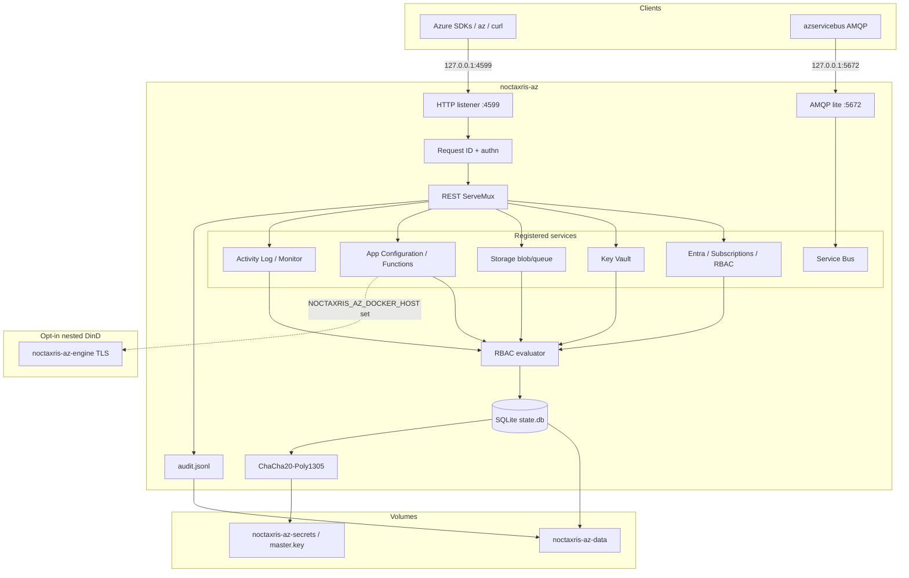

# Architecture

Noctaxris-AZ is a single Go process that serves Azure-shaped HTTP on loopback
`:4599` and Service Bus AMQP 1.0 lite on loopback `:5672`.

## Packages

| Package | Role |
|---------|------|
| `cmd/noctaxris-az` | Process entry |
| `internal/config` | `NOCTAXRIS_AZ_*` env load and listen security |
| `internal/kernel/authn` | Bearer and Shared Key helpers |
| `internal/kernel/authz` | Azure RBAC evaluator |
| `internal/kernel/audit` | Audit writer |
| `internal/kernel/httpegress` | Outbound HTTP fail-closed helpers |
| `internal/store` | SQLite schema and resource helpers |
| `internal/services/*` | Per-product HTTP / AMQP handlers |
| `internal/azerrors` | ARM-shaped error envelopes |
| `internal/compute` | Nested Docker host validation (no host sock) |

## Request path

1. Health / ready / version and Entra token skip auth.
2. ARM and data-plane Bearer paths authenticate, then evaluate RBAC (root bypass).
3. Storage Shared Key / SAS paths authenticate without RBAC role lookup.
4. Mutations may append Activity Log rows for Monitor list theatre.
5. Sensitive material is sealed with the master key outside the data root.
